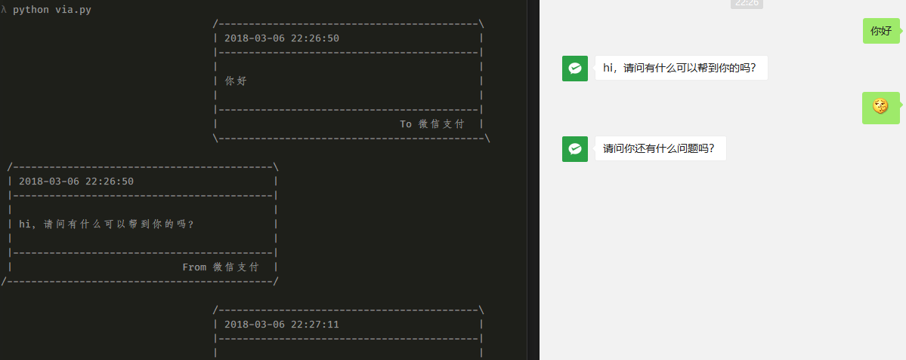

# wechat-db-decrypt
解密Windows微信聊天记录数据库



* 代码是 python3 的
* 代码是一边试，一边堆的，乱的很
* 首先要登陆微信，再打开脚本，脚本会每秒读一次数据库把聊天记录打印出来
* 不知道除了这么轮询之外还有什么方法没有

根据这个帖子 https://bbs.pediy.com/thread-222652.htm 手动获取解密数据库的步骤如下

1. 打开微信，先不要登陆
2. OD 附加，搜索字符串 "DBFactory::encryptDB"
3. 往下有个 `test edx, edx`，在哪里下断，edx 就指向 key，长度 32

嘛~ 具体怎么跟没搞清楚~

微信是调用 sqlite3_key 进行解密，所以 key 可以传递包含字符 `\0` 字串，如果用 [DB Browser for SQLite](http://sqlitebrowser.org/) 或者 [pyslite3](https://github.com/rigglemania/pysqlcipher3) 打开时无法要做点处理，具体为什么要看 https://github.com/CovenantEyes/sqlcipher-windows/blob/6747108170c4f8db11d55119414434c13ce5eb80/StaticLib/src/crypto_impl.c#L848
再为什么会知道是这里，编译 pyslite3 打日志打出来的

``` python
def get_password(path, key):
    """
    path 是具体的数据库的路径，不如聊天文本的数据库是 ChatMsg.db
    """
    salt = open(path, 'rb').read(16)
    dk=hashlib.pbkdf2_hmac('sha1', key, salt, 64000, dklen=32)
    return binascii.hexlify(dk).decode()
```

接下来代码里面获取这个 key 是通过读内存读出来的，有 key 之后用 CheatEngine 搜索找到地址挺简单的

再来是 Windows 下 pyslite3 编译问题
1. http://slproweb.com/products/Win32OpenSSL.html OpenSSL-Win32 要装 1.0.x
2. 编译的时候利用这个 [sqlcipher-windows
](https://github.com/CovenantEyes/sqlcipher-windows)

最后 CheatEngine 得到 wxid 地址，读注册表找到聊天记录路径，全部结合起来可以是个间谍软件 /_\
